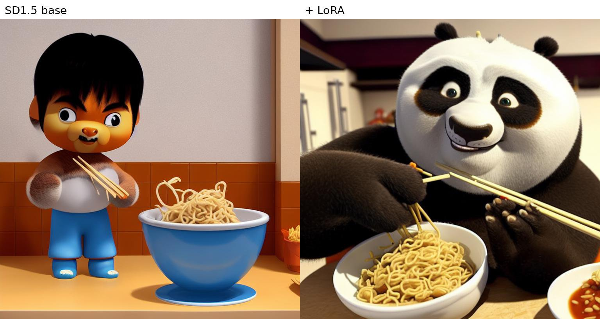
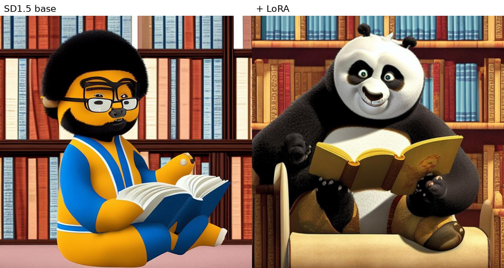
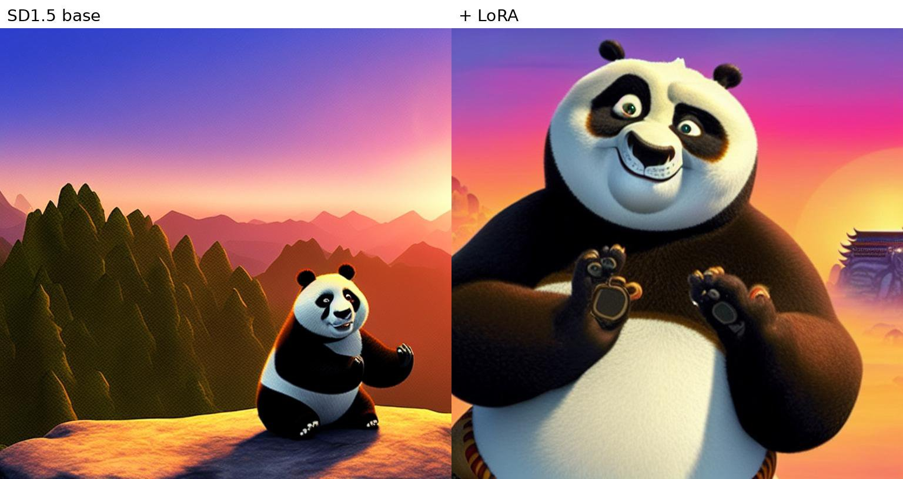

# LoRA Fine-tuning for Stable Diffusion

Fine-tune Stable Diffusion 1.5 with LoRA (Low-Rank Adaptation) on custom image datasets. The pipeline covers everything from data scraping to training and inference.

## Results

A LoRA trained on **18 scraped *Kung Fu Panda* stills of Po** (rank 16, learning rate 1e-4, 100 epochs with random flips, about 5 minutes on one NVIDIA L40S). Each pair uses the same prompt, seed and settings: the left image is base SD1.5, the right one adds the LoRA (epoch 100). Images are rendered at 512 px and refined at 768 px (`--hires_scale 1.5`).

**`a 3d animation still of 'Kung_Fu_Panda' eating noodles in a kitchen`**



**`a 3d animation still of 'Kung_Fu_Panda' reading a book in a library`**



**`a 3d animation still of 'Kung_Fu_Panda' meditating on a mountain at sunrise`**



Base SD1.5 does not know the `'Kung_Fu_Panda'` token and draws a generic cartoon character. The LoRA binds it to Po's face, fur, outfit and DreamWorks rendering style, while the rest of the prompt (noodles, library, sunrise) still sets the scene.

What made the difference compared with a first attempt (24 images, one shared caption `a photo of 'Kung_Fu_Panda'`, rank 4), which gave blurry, half-photographic results with distorted faces:

- **Data:** only images of Po alone (group shots with other characters were mixing in their features), no posters with text, no duplicates
- **Captions:** one caption per image describing pose and background (`a 3d animation still of 'Kung_Fu_Panda', holding a jade staff, standing in a sunny courtyard`), so the LoRA learns the character rather than the backgrounds, and "3d animation" instead of "photo"
- **Capacity:** rank 16 instead of 4
- **Inference:** DPM-Solver++ scheduler, a negative prompt, and a 1.5x hires pass

**Limitations:** the training set is mostly close-ups, so the LoRA pulls compositions toward a large Po in frame and can lose scene details (e.g. the court in *playing basketball*). A rank-32 run matched the face more closely but overfit more.

To reproduce, put the images in `lora_train/kfp_po/` with a `metadata.jsonl` of per-image captions, then:

```bash
python data/convert_data_from_jsonl.py --infolder lora_train/kfp_po
python train_LoRA.py --lora_rank 16 --lora_alpha 16 --num_epochs 100 --batch_size 2 \
    --gradient_accumulation_steps 1 --random_flip --save_epochs 20 --output_dir models/kfp_v2
python eval_LoRA.py --compare --hires_scale 1.5 --lora_path models/kfp_v2/checkpoints/checkpoint_epoch_100 \
    --prompt "a 3d animation still of 'Kung_Fu_Panda' eating noodles in a kitchen"
```

## Project Structure

```
lora-finetune/
├── data/
│   ├── scratch_data.py            # Step 1: Scrape images from Bing
│   ├── convert_data.py            # Step 2a: Build captions.json from image folders
│   └── convert_data_from_jsonl.py # Step 2b: Convert from existing .jsonl metadata
├── experiments/
│   └── vae_demo.py                # VAE encode/decode sanity check
├── train_LoRA.py                  # Step 3: Train LoRA on SD1.5
├── eval_LoRA.py                   # Step 4: Evaluate a checkpoint (--compare: base vs LoRA)
├── text_to_image.py               # Baseline inference (SD1.5 / SDXL / SD3)
├── assets/                        # Result images shown in this README
├── requirements.txt
└── .gitignore
```

## Pipeline Overview

```
Bing Images          Folder of images
     │                      │
scratch_data.py      convert_data.py / convert_data_from_jsonl.py
     │                      │
     └──────────────────────┘
                   │
            captions.json
                   │
            train_LoRA.py          ← LoRA fine-tuning on SD1.5
                   │
         checkpoints/epoch_N/
                   │
             eval_LoRA.py          ← Generate test images from checkpoint
```

## Quickstart

### 1. Install dependencies

```bash
pip install -r requirements.txt
```

### 2. Scrape training images

```bash
python data/scratch_data.py --tag Kung_Fu_Panda --count 20
```

Images are saved to `lora_train/<tag>/` (override with `--save_dir`).

### 3. Prepare captions

**Option A** — auto-generate captions from folder names (every sub-folder of `lora_train/` becomes a tag):
```bash
python data/convert_data.py                      # all tags
python data/convert_data.py --tags Kung_Fu_Panda # only some tags
```

**Option B** — convert from an existing `metadata.jsonl` (Hugging Face `imagefolder` format, `{"file_name": ..., "text": ...}`):
```bash
python data/convert_data_from_jsonl.py --infolder lora_train/animal
```

Both write `lora_train/captions.json` with entries like:
```json
[
  {"caption": "a photo of 'Kung_Fu_Panda'", "file_path": "lora_train/Kung_Fu_Panda/Kung_Fu_Panda_1.jpg"}
]
```

### 4. (Optional) Verify VAE

Sanity-check that the SD1.5 VAE can reconstruct your images cleanly:
```bash
python experiments/vae_demo.py input.png reconstruction.png
```

### 5. Train LoRA

```bash
python train_LoRA.py
```

Every option in `create_default_config()` can be overridden from the command line, e.g. a quick test run:
```bash
python train_LoRA.py --num_epochs 1 --batch_size 1 --image_size 256
```

| Parameter | Default | Description |
|---|---|---|
| `--captions_file` | `lora_train/captions.json` | Training data |
| `--output_dir` | `./models/lora_trained` | Where checkpoints and the final adapter go |
| `--learning_rate` | `1e-4` | AdamW learning rate |
| `--batch_size` | `2` | Batch size per step |
| `--gradient_accumulation_steps` | `2` | Effective batch = 4 |
| `--num_epochs` | `100` | Training epochs |
| `--image_size` | `512` | Training resolution |
| `--lora_rank` | `4` | LoRA rank (r) |
| `--lora_alpha` | `4` | LoRA scaling factor |
| `--save_steps` | `20` | Save checkpoint every N steps |
| `--save_epochs` | `1` | Save checkpoint every N epochs |
| `--random_flip` | off | Randomly mirror training images |

Checkpoints are saved to `models/lora_trained/checkpoints/checkpoint_epoch_N/` (plus `checkpoint_<step>/` every `save_steps`), and the final adapter to `models/lora_trained/`.

### 6. Evaluate a checkpoint

```bash
python eval_LoRA.py --prompt "a photo of 'Kung_Fu_Panda'"   # final adapter
python eval_LoRA.py --lora_path models/lora_trained/checkpoints/checkpoint_epoch_40
```

Add `--compare` to also render each prompt without the LoRA (same seed) and save the two side by side, as in [Results](#results). `--prompt` accepts several prompts at once. `--hires_scale 1.5` adds an img2img refinement pass at 1.5x resolution for sharper detail; `--negative_prompt` and `--guidance_scale` are also configurable.

Generated images are saved to `test_generations/`.

### 7. Baseline inference (no LoRA)

```bash
python text_to_image.py --model sd15 --prompt "an astronaut riding a horse"
python text_to_image.py --model sdxl --no_refiner
```

Supports SD1.5, SDXL (with optional refiner), and SD3 (gated on Hugging Face — accept the license and run `huggingface-cli login` first). Images are saved to `generated_images/`.

## How LoRA Works

LoRA freezes the original UNet weights and injects small trainable low-rank matrices into the attention layers. For a weight matrix **W** (M×N), instead of updating all M×N parameters, LoRA learns two smaller matrices **A** (M×r) and **B** (r×N) where r ≪ min(M,N).

Target modules: `to_k`, `to_q`, `to_v`, `to_out`, `proj_in`, `proj_out`, `ff.net.*`

The text encoder and VAE remain fully frozen throughout training.

## Requirements

- Python 3.9+
- An NVIDIA GPU (CUDA) or an Apple Silicon Mac (MPS) — the scripts pick the device automatically; CPU works but is very slow
- ~9 GB of GPU memory for SD1.5 LoRA training at batch size 2, image size 512 (measured on an L40S; about 7 GB at 256 px on an M1 Mac)
- PyTorch 2.3+ for the latest `diffusers`; on PyTorch 2.2, pin `diffusers==0.32.2 transformers==4.48.3 peft==0.14.0`

## Notes

- The Bing scraper in `scratch_data.py` is for educational use. Please respect Bing's Terms of Service and `robots.txt`.
- Model weights (`.safetensors`, `.bin`, `.pt`) are excluded from git via `.gitignore`. The base model ([stable-diffusion-v1-5/stable-diffusion-v1-5](https://huggingface.co/stable-diffusion-v1-5/stable-diffusion-v1-5), ~4 GB) is downloaded automatically by `diffusers` on first run; pass `--model_name` to use a local copy.
